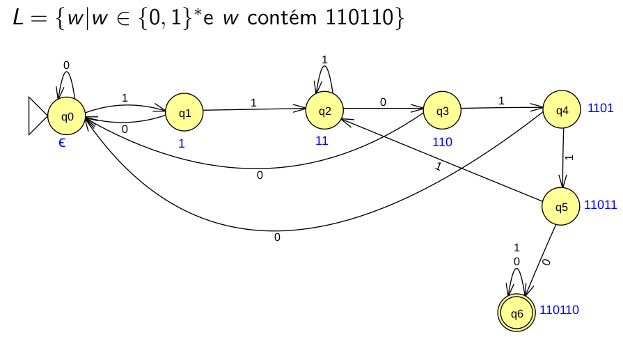

# Teoria da Computação

## Theory of Computation
A teoria da computação é dividida em 3 partes:
- Teoria da computabilidade
- Teoria da complexidade
- Teoria dos autômatos e linguagens: usa técnica para reconhecer padrões, define gramáticas.

## Chomsky's Hierarchy

 

## Regular Languages
São as linguagens mais simples na Hierarquia de Chomsky.
 
Exemplos:
- Analisador léxico
- Pesquisar por ocorrência de um padrão em uma palavra

### Regular Expressions
Expressão regular (ER) é outra forma de representar linguagens regulares.

## Context-Free Grammars
São linguagens mais poderosas que as linguagens regulares.
 
Exemplos:
- Analisador sintático
- Processador de texto

## Finite Automata
- É um modelo computacional que reconhece classes de linguagens regulares. Para fazer isso, só mantem o estado atual.

 

#### Exemplo de ADF

 

#### Exemplo de AFND

 

## Turing Machine
Alan Turing criou a _Turing Machine_ para compreender a computabilidade.

> Note: Computador quântico não invalida a tese de Church-Turing

#### Representation

- Fita infinita é dividida em células
- Cabeçote lê e escreve símbolos na fita
Cabeçote move para a esquerda e para a direita exatamente uma posição
- Cabeçote armazena um estado
- Células da fita contém exatamente um símbolo
- Células não inicialmente preenchidas possuem um símbolo de vazio

#### Turing Machine Example

 

[Aqui](exercicios/mestrado/resolucao_maquina_turing.pdf) tem um exemplo de resolução de questões sobre _Turing Machine_.

## Pumping Lema
O Pumping Lema serve para provar que algo não pertence a uma linguagem/gramática

## References
- [1] Michael Sipser, Introduction to the Theory of Computation

---

 

 

