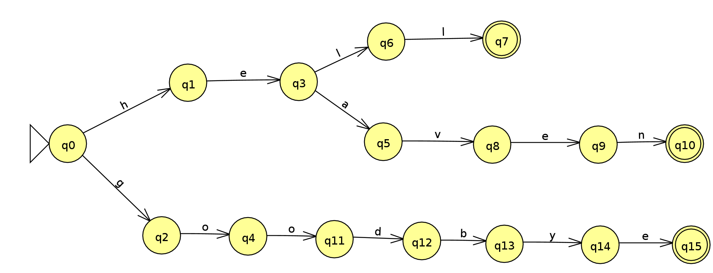

# Homework 01: Cellphone Typing
- A suffix automaton is a powerful data structure that allows solving many string-related problems.
- prefix tree
- Trie it is probably the **most basic and intuitive tree-based data structure designed for use with strings**.

## Automata Example



## Trie Implementation
- Trie Node
```python
class TrieNode:
  """Um nó na estrutura trie"""
  def __init__(self, char: str):
    # a letra armazenada neste nó
    self.char = char
    # pode ser o fim de uma palavra
    self.is_end = False
    # um dicionário de nós filhos, onde chaves são caracteres e os valores são nós
    self.children = {}
```

- Trie
```python
class Trie:
  def __init__(self):
    self.root = TrieNode("")
  
  def insert(self, word: str) -> None:
    node = self.root
    
    for char in word:
      # Verifica se o nó filho contem o caractere da word
      if char in node.children:
        node = node.children[char]
      else:
        # se não encontrado, cria o novo nó na trie
        new_node = TrieNode(char)
        node.children[char] = new_node
        node = new_node
        
   node.is_end = True
```
